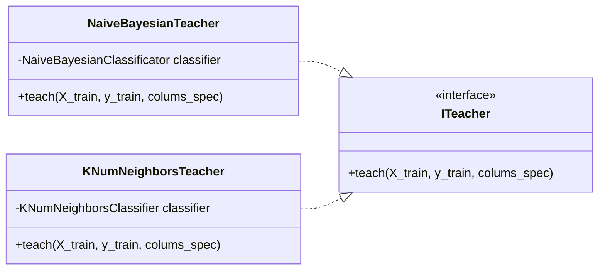
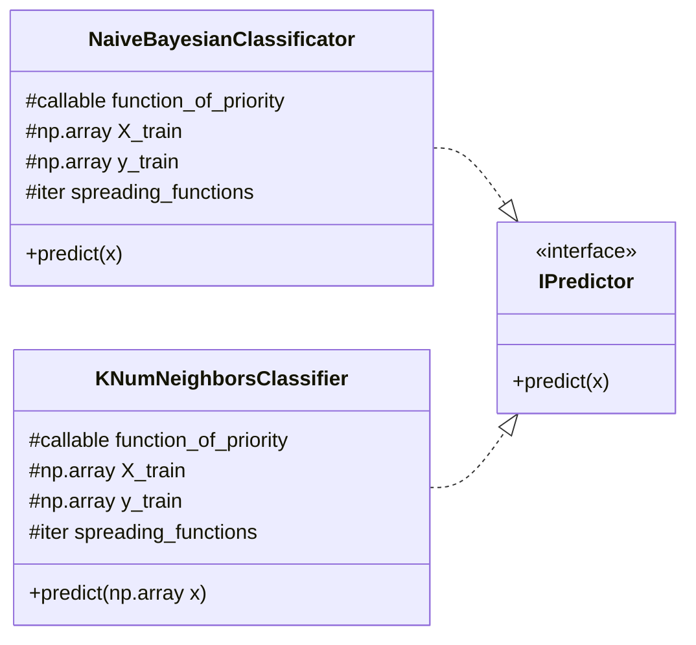

# Реализация классификаторов KNN и Наивного Баесовского.
## Реализация учителя

```mermaid
    classDiagram
        direction LR
        
        class ITeacher{
            <<interface>>
            +teach(X_train, y_train, colums_spec)
        }
        
        class NaiveBayesianTeacher{
            -NaiveBayesianClassificator classifier
            +teach(X_train, y_train, colums_spec)
        }

        class KNumNeighborsTeacher{
            -KNumNeighborsClassifier classifier
            +teach(X_train, y_train, colums_spec)
        }

        NaiveBayesianTeacher ..|> ITeacher
        KNumNeighborsTeacher ..|> ITeacher
```

## Реализация предикторов

```mermaid
    classDiagram
        direction LR
        
        class IPredictor{
            <<interface>>
            +predict(x)
        }
        
        class NaiveBayesianClassificator{
            #callable function_of_priority
            #np.array X_train
            #np.array y_train
            #iter spreading_functions
            +predict(x)
        }

        class KNumNeighborsClassifier{
            #callable function_of_priority
            #np.array X_train
            #np.array y_train
            #iter spreading_functions
            +predict(np.array x)
        }

        NaiveBayesianClassificator ..|> IPredictor
        KNumNeighborsClassifier ..|> IPredictor
```

